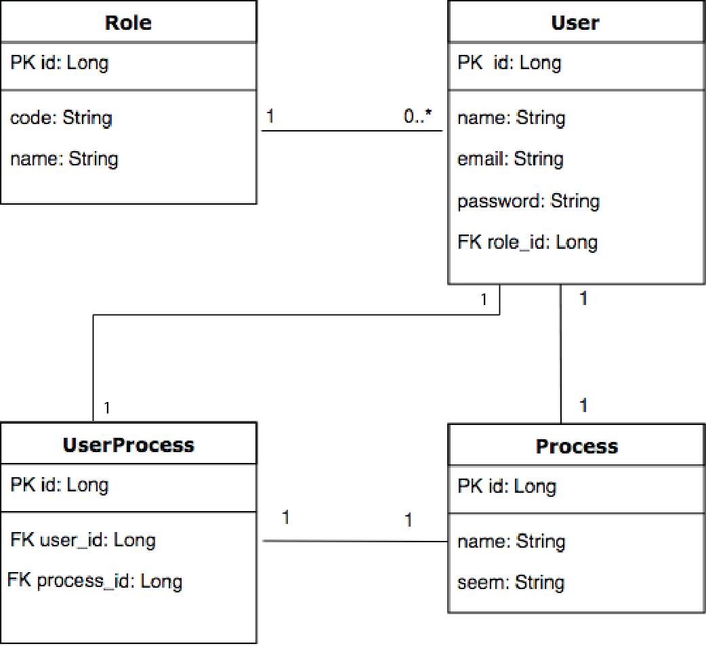

# Gerenciador de Processos

Projeto para o processo seletivo para a vaga de fullstack na [Softplan](https://www.softplan.com.br/carreira/).

## Objetivo do Projeto

O projeto visa criar um programa web para gerenciamento de processos. Optou-se em criar duas camadas para a aplicação: back-end, servidor, e front-end, camada de visualização.

## Tecnologias

### Back-End

O back-end ou servidor do projeto foi construído na linguagem Java utilizando os frameworks Spring, SpringBoot, RESTFull e Hibenate.

### Front-End

O front-end ou camada de visualização do projeto foi construído utilizando o framework VueJs.

### Banco de Dados

O banco de dados utilizado no projeto é o PostgreSQL. Sua escolha deve-se, principalmente, por ser Open Source e de grande poderio.

#### Modelagem do Banco de Dados

O banco de dados foi modelado conforme o diagrama ER.

A aplicação contém quatro (4) classes: Usuário (User), Função (Role), Processo (Process) e Usuário-Processo (UserProcess). 

- **User**: Usuário da aplicação;
- **Role**: Defini as funções de cada usuário;
- **Process**: Processo a ser gerenciado;
- **UserProcess**: Vinculação de um usuário com um processo específico.
