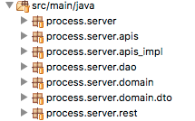

# Gerenciador de Processos

Projeto para o processo seletivo para a vaga de fullstack na [Softplan](https://www.softplan.com.br/carreira/).

## O Projeto

### Objetivo do Projeto

O projeto visa criar um programa web para gerenciamento de processos. 

### Suposições

As suposições utilizadas ao longo do projeto foram:

1. Não é possível cadastrar roles. Isto é, o projeto só contém três roles: Administrador, Usuário - Triador e Usuário - Finalizador.

2. Não é possível cadastrar usuário antes de fazer login no sistema. Apenas os usuários com perfil de Administrador podem criar novos usuários. 

3. Usuários são passíveis de remoção. Porém, ao deletar um usuário é realizado uma verificação para assegurar a integridade do sistema. Ou seja, Não é possível deletar um usuário do perfil Usuário - Finalizador que possua processos vinculados a ele.

4. Não é possível deletar processos. Assim, após a criação de um processo, é permitido apenas a sua edição.

5. O parecer de um processo pode ser preenchido ou removido apenas pelos usuários com perfil de Usuário - Finalizador que foram vinculados para esse processo.

6. Ao ser preenchido um parecer, o processo não muda de estado. Isso é, o parecer pode ser editado e/ou removido várias vezes por qualquer usuário vinculado ao mesmo.

### Tecnologias

O projeto foi projetado para possui duas camadas: back-end, servidor, e front-end, camada de visualização.

#### Back-End

O back-end ou servidor do projeto foi construído na linguagem Java utilizando os frameworks Spring, SpringBoot, RESTFull e Hibenate.

A estrutura do servidor é mostrado abaixo: 

Onde,

* process.server: Encontra-se a aplicação Spring Boot e sua configuração. 
* process.server.apis: Encontra-se as interfaces dos serviços.
* process.server.apis_impl: Encontra-se as implementações das interfaces dos serviços.
* process.server.dao: Encontra-se as interfaces de abstração para acessar os dados do banco de dados.
* process.server.domain: Encontra-se as classes que modelam as entidades do banco de dados.
* process.server.domain.dto: Encontra-se os objetos de transfência de dados (Data Transfer Object).
* process.server.rest: Encontra-se os controllers que expõem as APIS.

#### Front-End

O front-end ou camada de visualização do projeto foi construído utilizando o framework VueJs.

#### Banco de Dados

O banco de dados utilizado no projeto é o PostgreSQL. Sua escolha deve-se, principalmente, por ser Open Source e de grande poderio.

#### Modelagem do Banco de Dados

O banco de dados foi modelado conforme o diagrama ER.

A aplicação contém quatro (4) classes: Usuário (User), Função (Role), Processo (Process) e Usuário-Processo (UserProcess). 

- **User**: Usuário da aplicação;
- **Role**: Defini as funções de cada usuário;
- **Process**: Processo a ser gerenciado;
- **UserProcess**: Vinculação de um usuário com um processo específico.

## Executando a Aplicação

Passo a passo para colocar instalar, configurar e executar o servidor e a aplicação web.
Obs: Antes de executar os passos a seguir, é necessário clonar o repositório.

### Servidor

1. Instalar o PostgreSQL através do [tutorial](server/docs/install_postgresql.md).

2. Executar o arquivo [insert.sql](server/docs/insert.sql) a carga inicial dos dados. É necessário executar essa carga porque as roles e o usuário administrador são criados.

3. Abrir o Eclipse (ou sua IDE preferida) e importar o servidor (**.../softplan-desafio-fullstack/server**).

4. Após importar, abra o arquivo App.java e mande rodar como Java Application.

5. Pronto, após esses passos, o servidor já está rodando. 

### Aplicação Web

1. Abrir o terminal e navegar até a aplicação web (**.../softplan-desafio-fullstack/app_web**).

2. Executar **npm install** para baixar todas as dependências necessárias para a aplicação ser executada.

3. Depois, executar **npm start**.

4. Pronto, após esses passos, a aplicação web já está rodando no endereço [http://localhost:3000/](http://localhost:3000/).
